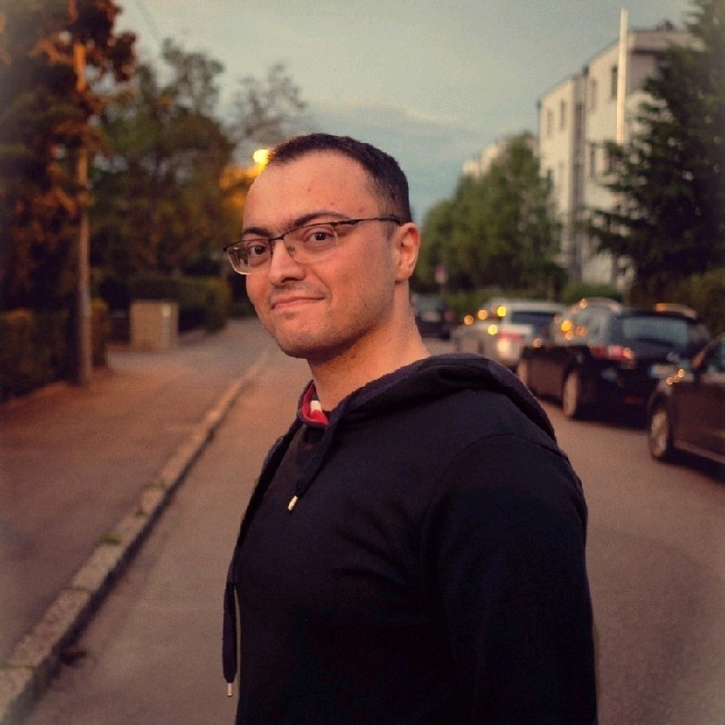

  
  <h1>Fikrat Talibli</h1>
  
<strong>PhD Candidate – Computational Biology & Algorithmics</strong> 
  University of Stuttgart • Expected defense: April–June 2026 
  <a href="mailto:fikrattalibli@gmail.com">fikrattalibli@gmail.com</a> • <a href="https://www.linkedin.com/in/feeka/"> LinkedIn </a> • Stuttgart, Germany 

### Research focus & favorite topics
Error-correcting codes for DNA data storage • Trace reconstruction • Succinct de Bruijn graphs • Metagenomics • Complex graphs • Abstract algebra • Graph algorithms • DSL(domain-specific language) development • Neural nets • Neural ordinary differential equations

### Selected projects & publications

- **rs-dna-pipeline: Modular Reed–Solomon(extendable to other codes) library for DNA storage (v0.2.0, Dec 2025)** - _99%+ recovery at 2% indel noise (benchmarks in repo)_ → [GitHub](https://github.com/feeka/dna-storage)
- MCAAT: Metagenomic CRISPR Array Analysis Tool (first author, microLife 2025) - _Scales to billion-node de Bruijn graphs, detecting CRISPR systems in unassembled metagenomes_ → [DOI: 10.1093/femsml/uqaf016](https://doi.org/10.1093/femsml/uqaf016) • [GitHub](https://github.com/RNABioInfo/mcaat) 
- Master thesis (2020): Cyclic codes for error detection in DNA storage - _Low-overhead cyclic parity layer that reliably flags typical sequencing errors for early DNA-storage prototypes_ → [PDF](assets/mt_dna_storage.pdf) → [GitHub](https://github.com/feeka/mt_dna_as_storage.git)
- Study project (2019): API for Error Control Codes → [PDF](assets/study_project.pdf) • [GitHub](https://github.com/feeka/reed_solomon_codes.git) 
- In progress [•]: MCAAT 2.0: Spacer ordering and phage detection in metagenomic data - _Enumerate all the long paths in de Bruijn graph using BeamSearch algorithm_ → [GitHub](https://github.com/RNABioInfo/mcaat)

### Recent talks & seminars
- **“Efficient trace reconstruction using Bidirectional Beam Search” (Gu et al. 2025) – Literature seminar, Nov 2025** → [slides](./assets/bbs_seminar.pdf)
- “Succinct de Bruijn graphs & Metagraph” – Group meeting, 2025
- "BeamSearch for detecting phages in human gut virome" - Institute meeting, Oct 2025
- "WS2025/2026" - machine learning in biology  

### Skills
C++ • Succinct data structures • OpenMP • Python (NumPy, PyTorch, pyhmmer) • HMMs & Viterbi • Beam search • Compiler level HPC memory optimisations

### Languages
Azerbaijani (native) • English (C1/C2) • Russian (C1/C2) • German (B2) • French (B1/B2)

 

  <a href="assets/talibli_cv.pdf">Download CV as PDF</a> • Last updated: October 2025

